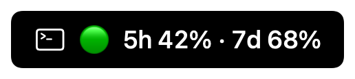
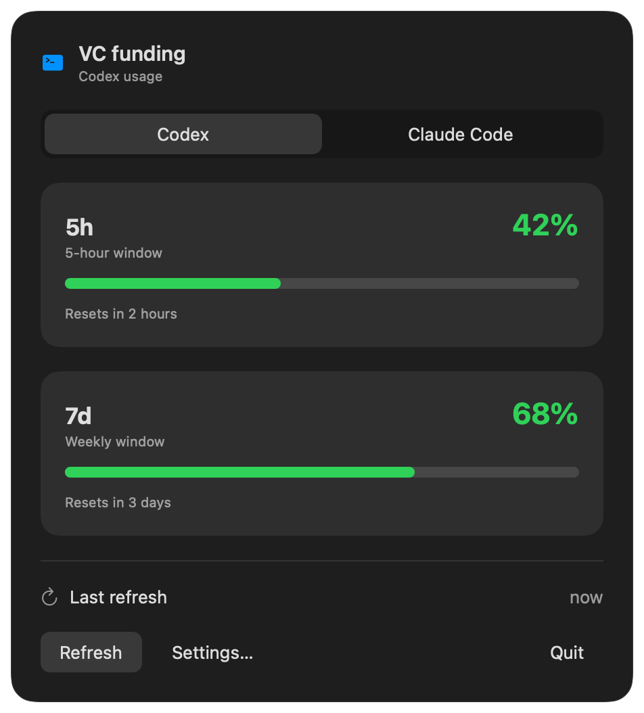
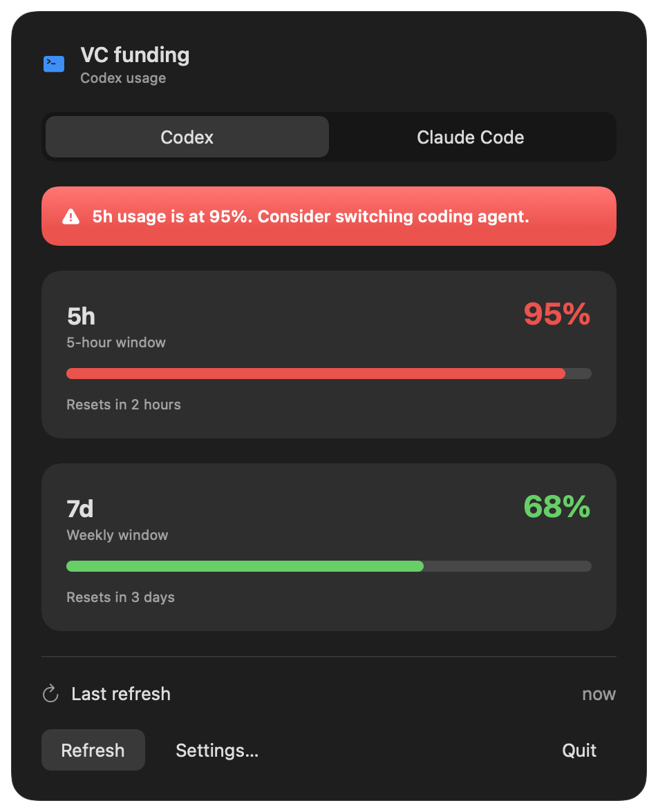

# vc-funding

> Your coding agent's runway, living quietly in the macOS menu bar.

```text
〉_ 5h 42% · 7d 68%
```

**vc-funding** is a private, native macOS menu bar app for checking coding-agent usage without opening a dashboard. Percentages use traffic-light colors, unavailable windows stay out of the menu bar, and a warning tells you when it may be time to switch agents.



<p align="center">
  
  
</p>

## What it does

- Shows current 5-hour and weekly Codex usage in the menu bar
- Colors available percentages green, orange, or red
- Omits unavailable values instead of displaying `N/A`
- Shows reset countdowns and last-refresh time
- Warns at 90% usage with a deduplicated native macOS notification
- Shows **Time to burn tokens 🔥** when unused quota is close to resetting
- Provides Codex and Claude Code tabs, ready for more providers
- Refreshes every five minutes, with a manual refresh button
- Can launch automatically at login
- Runs locally with no analytics, credential logging, or uploads

## Status at a glance

| Usage | Color | Meaning |
| ---: | :---: | --- |
| 0–69% | 🟢 | Plenty of runway |
| 70–89% | 🟠 | Keep an eye on it |
| 90–100% | 🔴 | Consider switching agent |

The menu bar uses a macOS-safe `🟢/🟠/🔴` indicator so the percentage remains readable in light and dark menu bars. At 90%, the app requests notification permission and sends one native notification per reset window—no repeated notification every five minutes.

The 🔥 alert appears when at least 20% remains with less than one hour before a 5-hour reset, or less than 24 hours before a weekly reset. Switch alerts take priority over burn alerts. If a window has no fresh local value, it is simply omitted from the menu bar and explained inside the dropdown.

## Agent support

| Agent | Status | Source |
| --- | --- | --- |
| OpenAI Codex | ✅ Available | Local Codex session events |
| Claude Code | 🧩 UI ready | Provider not configured yet |
| Other agents | 🔌 Extensible | Add an `AgentUsageProvider` |

## Privacy and data source

The app is local-only. It makes no network requests, never opens `~/.codex/auth.json`, and never uploads or logs credentials.

Codex CLI 0.153.2 exposes no documented usage command on the machine used to build this project. The safest available source is the `rate_limits` object written by Codex to local JSONL session events:

```text
$CODEX_HOME/sessions/**/*.jsonl
```

`CODEX_HOME` defaults to `~/.codex`. Relevant `token_count` events contain `used_percent`, `window_minutes`, and `resets_at`.

The provider reads only bounded tails of recent session files, recognizes the 300-minute and 10,080-minute windows, and keeps the newest non-expired value for each. It never derives quotas from token counts, reads authentication state, calls undocumented endpoints, or bypasses authentication.

This local event schema is not a documented stable public API and may change in a future Codex release. The app fails gracefully when a directory, event, or window is unavailable.

## Requirements

- macOS 13 or newer
- Xcode and the Swift toolchain
- Codex CLI or Codex desktop app with local session history

The current build is verified with Xcode 26.6 and Swift 6.3.3.

## Build, test, and run

```sh
swift test
./scripts/build-app.sh
open .build/vc-funding.app
```

For a stable installation path, copy the bundle before enabling launch at login:

```sh
cp -R .build/vc-funding.app /Applications/
open /Applications/vc-funding.app
```

Then open **Settings…** and enable **Launch at login**. macOS may also show it under **System Settings → General → Login Items**.

For development, `swift run vc-funding` works too, but launch-at-login registration requires the packaged `.app`.

## Install with npx

Once the package is published to npm:

```sh
npx vc-funding
```

This builds the native app from the packaged Swift source and opens it. To keep a stable copy in `~/Applications`—recommended for launch at login—run:

```sh
npx vc-funding --install
```

Node.js 18+, Swift, and macOS 13+ are required. Maintainers can validate the exact npm payload before publishing with `npm run pack:check`.

## Install with Homebrew

Native macOS applications are distributed through a Homebrew Cask. After a release archive and tap are published, installation is:

```sh
brew install --cask vc-funding
```

Maintainer release flow:

```sh
./scripts/package-release.sh
./scripts/generate-cask.sh \
  "https://github.com/OWNER/REPO/releases/download/v0.1.0/vc-funding-0.1.0.zip" \
  "https://github.com/OWNER/REPO" \
  dist/vc-funding-0.1.0.zip
```

Commit the generated `Casks/vc-funding.rb` to the Homebrew tap repository. The generator inserts the app version and archive SHA-256 into the Cask; the generated file is ignored here to prevent accidentally committing placeholder release URLs.

## Architecture

```text
Codex session JSONL
        │
        ▼
CodexUsageProvider ──► AgentUsageProvider
        │                       │
        ▼                       ▼
CodexUsageParser         future providers
        │
        ▼
UsageSnapshot ──► UsageStore ──► MenuBarExtra + agent tabs
                         │
                         └─────► switch warning (≥ 90%)
```

Key components:

- `AgentUsageProvider` isolates each agent's data source from the UI
- `CodexUsageProvider` performs the bounded, read-only local scan
- `CodexUsageParser` contains pure JSONL parsing and window selection
- `UsageSnapshot` is the provider-neutral model
- `UsageStore` combines providers and owns alert/display state
- `RefreshScheduler` drives the five-minute refresh lifecycle
- SwiftUI renders the `MenuBarExtra`, tabs, usage cards, and settings

To add an agent, implement `AgentUsageProvider`, return a `UsageSnapshot`, register the provider in `VCFundingApp`, and add its case to `CodingAgent`.

## Tests

The Swift Testing suite covers parsing, malformed input, newest-event selection, expired windows, percentage clamping, display formatting without `N/A`, switch-alert and notification boundaries, independent multi-provider results, and filesystem discovery through a temporary Codex session tree.

Demo screenshots are rendered deterministically from SwiftUI, without account data:

```sh
swiftc -parse-as-library scripts/render-demo-screenshots.swift -o /tmp/render-vc-funding
/tmp/render-vc-funding docs/screenshots
```

## License

No license is included because this repository is intended to remain private. Without a license, no reuse rights are granted by default.
