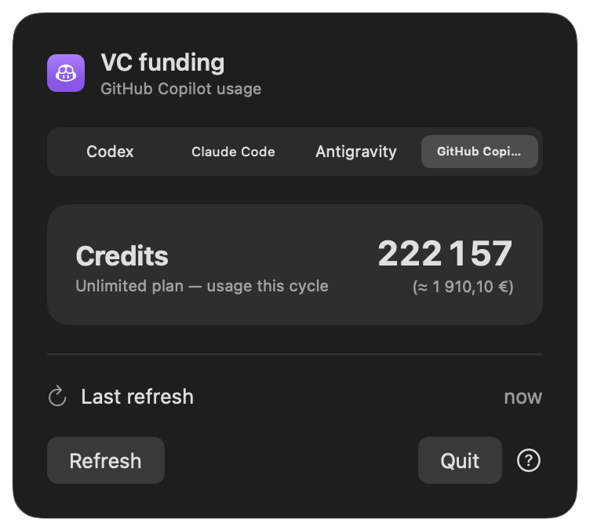

# vc-funding

> Your coding agent's runway, quietly visible in the macOS menu bar.

[⭐️ Star vc-funding on GitHub](https://github.com/Fran-cois/vc-funding)


<p align="center">
  
  
  
</p>

## Features

- Native SwiftUI `MenuBarExtra` for macOS 13+
- Codex 5-hour and weekly usage percentages
- Green, orange, and red status indicators
- Reset countdowns and five-minute automatic refresh
- Animated money loader during refresh
- **Time to switch** alert at 90%
- **Time to burn tokens** alert before unused quota resets
- Deduplicated native macOS notifications
- Launch at login
- Provider tabs for Codex, Claude Code, Antigravity, GitHub Copilot, and OpenRouter, shown only when usage data is available
- Friendly empty state when no supported coding agent is detected
- No analytics or uploads; opt-in, off-by-default GitHub Copilot and OpenRouter checks are the only providers that read a credential and call the network
- Opt-in weekly leaderboard with two just-for-fun prizes: **maxeur de plan max** and **corporate maxing**

## Install

### Download

Download `vc-funding-0.1.0.zip` from the [latest GitHub release](https://github.com/Fran-cois/vc-funding/releases/latest), move `vc-funding.app` to `/Applications`, and open it.

### Homebrew

Once the Cask is published in the tap:

```sh
brew install --cask vc-funding
```

### Build from source

```sh
git clone https://github.com/Fran-cois/vc-funding.git
cd vc-funding
swift test
./scripts/build-app.sh
open .build/vc-funding.app
```

## Privacy and data source

Provider discovery checks only whether known local app/session directories exist. It does not read credentials or send discovery data anywhere. A tab appears only after its provider returns usable local usage data; an installed but unconfigured provider stays hidden. If none returns data, the menu displays **No VC funding found…**.

vc-funding makes no network requests, with one explicit exception: an off-by-default GitHub Copilot toggle (see below). Every other provider reads only Codex `token_count.rate_limits` events from:

```text
$CODEX_HOME/sessions/**/*.jsonl
```

`CODEX_HOME` defaults to `~/.codex`. The app never opens `~/.codex/auth.json`, logs credentials, derives quotas from token counts, or calls undocumented endpoints.

The local event schema is not a documented stable public API. Missing or expired windows are omitted from the menu bar and explained in the dropdown.

### How Claude Code data works

Claude Code is visible as a provider tab, but **vc-funding does not collect its usage yet**. The safe integration path is Claude Code's documented [`statusLine` JSON](https://code.claude.com/docs/en/statusline), not its authentication files.

Claude Code sends these fields to a configured local status-line command:

```text
rate_limits.five_hour.used_percentage
rate_limits.five_hour.resets_at
rate_limits.seven_day.used_percentage
rate_limits.seven_day.resets_at
```

A future `ClaudeCodeUsageProvider` will read only those four values from a small local cache written by the status-line command. It will not inspect OAuth tokens, API keys, transcripts, prompts, or account details. Until that provider and opt-in setup are implemented, the Claude Code tab intentionally displays **not configured**.

### How Antigravity data works

Antigravity is available as a provider tab, but **vc-funding does not collect its usage yet**. Antigravity CLI officially exposes model quotas through its interactive [`/usage` (`/quota`) panel](https://www.antigravity.google/docs/cli/commands/usage/). Opening that panel refreshes quota state from its backend and local disk.

The official documentation does not currently describe a stable machine-readable quota command or local quota-file schema. Therefore vc-funding does not scrape the TUI, invoke private endpoints, or inspect Google credentials. The Antigravity tab intentionally displays **not configured** until Google documents a safe structured source.

### How GitHub Copilot data works

GitHub Copilot has no local usage file to read, unlike Codex. Its quota is only exposed through GitHub's internal `copilot_internal/user` API, which needs a token. vc-funding tries the `gh` CLI's own managed token first (`gh auth token`, refreshed automatically by `gh` itself), then falls back to the long-lived tokens editor extensions store locally in `~/.config/github-copilot/hosts.json` or `apps.json`, which can go stale without being removed.

Because reading a token and calling the network breaks the guarantees every other provider gives you, this is **off by default**. Enable it from the ⓘ info panel's "Enable GitHub Copilot usage (network)" toggle, right under a warning explaining exactly what it does. Once enabled, vc-funding calls `api.github.com/copilot_internal/user` and maps your premium-request quota's `percent_remaining` into the weekly window (Copilot's quota resets monthly, not weekly — the label is reused since the app has no monthly bucket). An unlimited Copilot plan has no percentage to show, so vc-funding instead displays the raw `credits_used` figure for the current cycle, next to an approximate euro amount (1 AI credit = $0.01 USD, per [GitHub's docs](https://docs.github.com/en/copilot/concepts/billing/usage-based-billing-for-organizations-and-enterprises), converted with a static, non-live USD→EUR rate). Disabling the toggle reverts to **not configured**, and no request is made unless the toggle is on.

### How OpenRouter data works

OpenRouter has no local sign-in to read, so you paste your own [API key](https://openrouter.ai/settings/keys) into the ⓘ info panel's "Enable OpenRouter usage (network)" field. It's stored in the macOS Keychain, never in `UserDefaults` or on disk elsewhere, and is only used to call `GET api.openrouter.ai/api/v1/key`. vc-funding reads `usage_weekly` (USD spent in the current UTC week, per [OpenRouter's docs](https://openrouter.ai/docs/api-reference/limits) — OpenRouter credits are already USD, unlike GitHub's AI credits) and shows it as a "Cost" card, same euro estimate as Copilot's unlimited-plan card. Off by default; disabling the toggle reverts to **not configured**.

## Weekly leaderboard

Tap the 🏆 button (next to ⓘ) to see this week's **top 10** for two just-for-fun prizes, and optionally share your own stats:

- **🏆 Maxeur de plan max** — most distinct 5-hour windows observed maxed out (≥95%) this week, across every detected provider.
- **💸 Corporate Maxing** — most spent out of pocket this week (GitHub Copilot credits and/or OpenRouter usage, converted to USD).

Each row shows a country flag derived by Cloudflare from the submitter's IP at request time (never sent by the client, never GPS/location data — just the coarse, standard geolocation every request to any website already exposes). It's absent for IPs Cloudflare can't place (e.g. some VPNs/Tor).

Sharing is **entirely opt-in and off by default**. Nothing is sent anywhere until you toggle "Share my stats" and enter a handle (your GitHub username or any nickname — it's public, no login is required). There is no authentication on the backend, so treat scores as for fun, not verified. The backend is a small Cloudflare Worker + D1 database (source in [`leaderboard/`](leaderboard/)); the server computes the week from its own clock and only ever sees the handle, the counts/amounts you're already viewing locally, and the request's country.

## Alerts

| Indicator | Meaning |
| :---: | --- |
| 🟢 | 0–69% used |
| 🟠 | 70–89% used |
| 🔴 | 90–100% used — consider switching |
| 🔥 | At least 20% remains shortly before reset |

The 🔥 window is the final hour of a 5-hour quota or the final 24 hours of a weekly quota. Switch alerts take priority. Each native notification is sent only once per reset window.

## Architecture

```text
Codex session events → CodexUsageProvider → UsageSnapshot
                                                ↓
AgentUsageProvider → UsageStore → MenuBarExtra + alerts
```

Implement `AgentUsageProvider` and register it in `VCFundingApp` to add another coding agent.

## Development

```sh
swift test
./scripts/check-release.sh 0.1.0
```

The suite currently covers parsing, filesystem discovery, expired windows, display state, multiple providers, and alert boundaries. Release instructions are in [`RELEASE.md`](RELEASE.md).

## License

[MIT](LICENSE) © 2026 Fran-cois.
